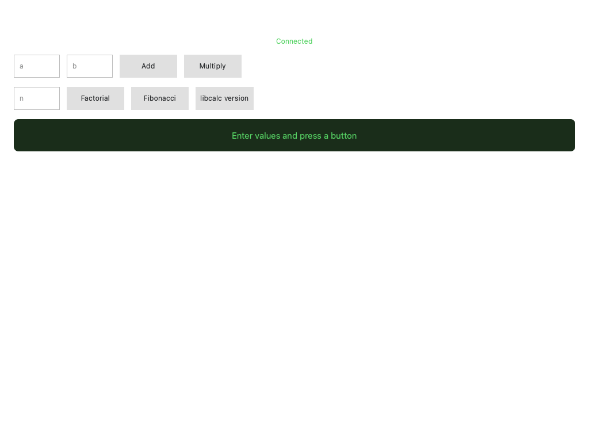
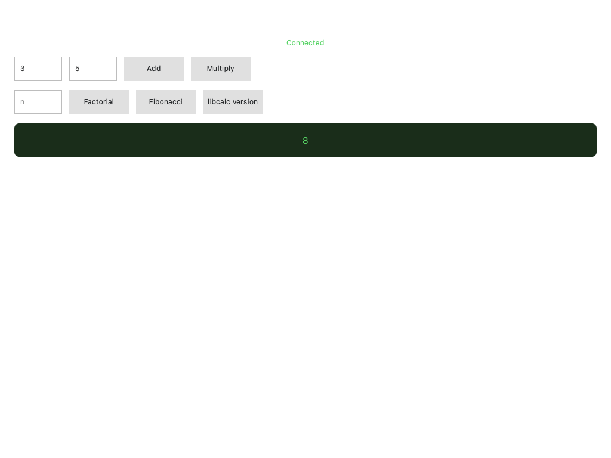

# Build a Logos C++ UI module

#### Get started building a ui_qml module with a C++ backend that runs in a separate process.

This guide covers building a module that pairs a QML user interface with a C++ backend plugin. The backend runs in a separate `ui-host` process while the QML view loads inside the host app (`logos-basecamp` or `logos-standalone-app`), so a backend crash cannot bring down the host. This guide is intended for developers who have completed [Part 1](wrap-a-c-library-as-a-logos-core-module.md) and want typed, process-isolated inter-module calls from their UI layer.

**Before you start**, make sure you have the following:

- Completed [Part 1](wrap-a-c-library-as-a-logos-core-module.md) — a working `calc_module` with the shared library built in `logos-calc-module/lib/`.
- Nix with flakes enabled.
- Basic familiarity with [QML](https://doc.qt.io/qt-6/qmlapplications.html)

## What to expect

- You can scaffold, configure, and build a `calc_ui_cpp` module with a process-isolated C++ backend.
- You can call `calc_module` methods from QML using a typed replica and `logos.watch()`.
- You will be able to build, run, and live-reload the module using `nix run`.

## Step 1: Scaffold the project

Create a new directory and initialise it from the C++ backend UI template.

1. Create and enter the project directory:

   ```bash
   mkdir logos-calc-ui-cpp && cd logos-calc-ui-cpp
   ```

1. Initialise from the template:

   ```bash
   nix flake init -t github:logos-co/logos-module-builder/tutorial-v3#ui-qml-backend
   ```

1. Initialise a Git repository and stage all generated files:

   ```bash
   git init && git add -A
   ```

1. Remove the template's example sources. The scaffolded template includes `ui_example` files with mismatched class names and IIDs; leaving them causes build errors or plugin-load failures at runtime:

   ```bash
   rm -f src/ui_example.rep src/ui_example_interface.h src/ui_example_plugin.h src/ui_example_plugin.cpp
   ```

## Step 2: Configure the module metadata

Replace the template `metadata.json` with your plugin's details.



The `calc_module.url` input attribute name in `flake.nix` must match the dependency name declared here in `"dependencies"`.



1. Replace `metadata.json` with the following:

   ```json
   {
     "name": "calc_ui_cpp",
     "version": "1.0.0",
     "type": "ui_qml",
     "category": "tools",
     "description": "Calculator C++ UI — QML view with process-isolated backend for calc_module",
     "main": "calc_ui_cpp_plugin",
     "view": "qml/Main.qml",
     "icon": "icons/calc.png",
     "dependencies": ["calc_module"],

     "nix": {
       "packages": { "build": [], "runtime": [] },
       "external_libraries": [],
       "cmake": {
         "find_packages": [],
         "extra_sources": [],
         "extra_include_dirs": [],
         "extra_link_libraries": []
       }
     }
   }
   ```

   Key fields:

   - `"type": "ui_qml"` — tells the builder this is a QML view module.
   - `"main": "calc_ui_cpp_plugin"` — the backend Qt plugin library name (without extension).
   - `"view": "qml/Main.qml"` — the QML entry point.
   - `"dependencies": ["calc_module"]` — core modules the backend calls.

1. Create the icons directory and add a placeholder icon (displayed in the `logos-basecamp` sidebar when the module is loaded):

   ```bash
   mkdir -p icons
   # Copy any PNG here - or generate a 64x64 placeholder:
   echo "iVBORw0KGgoAAAANSUhEUgAAAEAAAABACAYAAACqaXHeAAAAmElEQVR4nO3QMREAIBDAsFeEN3ziCWRkoEP2XmedfX82OkBrgA7QGqADtAboAK0BOkBrgA7QGqADtAboAK0BOkBrgA7QGqADtAboAK0BOkBrgA7QGqADtAboAK0BOkBrgA7QGqADtAboAK0BOkBrgA7QGqADtAboAK0BOkBrgA7QGqADtAboAK0BOkBrgA7QGqADtAboAO0BN/SiO/PatoIAAAAASUVORK5CYII=" | base64 -d > icons/calc.png
   ```

## Step 3: Define the remote interface

The `.rep` file is the single source of truth for the interface between the QML view and the C++ backend. `repc` compiles it at build time into typed source and replica headers.

1. Create `src/calc_ui_cpp.rep`:

   ```rep
   class CalcUiCpp
   {
       SLOT(int add(int a, int b))
       SLOT(int multiply(int a, int b))
       SLOT(int factorial(int n))
       SLOT(int fibonacci(int n))
       SLOT(QString libVersion())
   }
   ```

   `repc` generates two headers from this file:

   - `rep_calc_ui_cpp_source.h` — `CalcUiCppSimpleSource` with virtual slots the backend overrides.
   - `rep_calc_ui_cpp_replica.h` — `CalcUiCppReplica` with typed methods the QML view calls.

## Step 4: Write the interface header

Create `src/calc_ui_cpp_interface.h`:

```cpp
#ifndef CALC_UI_CPP_INTERFACE_H
#define CALC_UI_CPP_INTERFACE_H

#include <QObject>
#include <QString>
#include "interface.h"

class CalcUiCppInterface : public PluginInterface
{
public:
    virtual ~CalcUiCppInterface() = default;
};

#define CalcUiCppInterface_iid "org.logos.CalcUiCppInterface"
Q_DECLARE_INTERFACE(CalcUiCppInterface, CalcUiCppInterface_iid)

#endif // CALC_UI_CPP_INTERFACE_H
```

## Step 5: Configure the CMake build

Create `CMakeLists.txt`:

```cmake
cmake_minimum_required(VERSION 3.14)
project(CalcUiCppPlugin LANGUAGES CXX)

if(DEFINED ENV{LOGOS_MODULE_BUILDER_ROOT})
    include($ENV{LOGOS_MODULE_BUILDER_ROOT}/cmake/LogosModule.cmake)
else()
    message(FATAL_ERROR "LogosModule.cmake not found. Set LOGOS_MODULE_BUILDER_ROOT.")
endif()

logos_module(
    NAME calc_ui_cpp
    REP_FILE src/calc_ui_cpp.rep
    SOURCES
        src/calc_ui_cpp_interface.h
        src/calc_ui_cpp_plugin.h
        src/calc_ui_cpp_plugin.cpp
)
```

`REP_FILE` tells `logos_module()` to run `repc` to generate source/replica headers, generate `CalcUiCppViewPluginBase`, and build a separate `calc_ui_cpp_replica_factory` shared library.

## Step 6: Write the C++ backend plugin

The backend plugin inherits three base classes:

- `CalcUiCppSimpleSource` — generated from `.rep`, provides the typed source for Qt Remote Objects.
- `CalcUiCppInterface` — standard Logos plugin interface (`name()`, `version()`).
- `CalcUiCppViewPluginBase` — generated, provides `setBackend()` and `enableRemoting()`.

1. Create `src/calc_ui_cpp_plugin.h`:

   ```cpp
   #ifndef CALC_UI_CPP_PLUGIN_H
   #define CALC_UI_CPP_PLUGIN_H

   #include <QString>
   #include <QVariantList>
   #include "calc_ui_cpp_interface.h"
   #include "LogosViewPluginBase.h"
   #include "rep_calc_ui_cpp_source.h"

   class LogosAPI;
   class LogosModules;
   
   class CalcUiCppPlugin : public CalcUiCppSimpleSource,
                           public CalcUiCppInterface,
                           public CalcUiCppViewPluginBase
   {
       Q_OBJECT
       Q_PLUGIN_METADATA(IID CalcUiCppInterface_iid FILE "metadata.json")
       Q_INTERFACES(CalcUiCppInterface)

   public:
       explicit CalcUiCppPlugin(QObject* parent = nullptr);
       ~CalcUiCppPlugin() override;

       QString name()    const override { return "calc_ui_cpp"; }
       QString version() const override { return "1.0.0"; }

       Q_INVOKABLE void initLogos(LogosAPI* api);
       
       // Slots from calc_ui_cpp.rep — return values directly. The QML replica
       // receives QRemoteObjectPendingReply; use logos.watch() in QML to get the value.
       int add(int a, int b) override;
       int multiply(int a, int b) override;
       int factorial(int n) override;
       int fibonacci(int n) override;
       QString libVersion() override;

   signals:
       void eventResponse(const QString& eventName, const QVariantList& args);

   private:
       LogosAPI* m_logosAPI = nullptr;
       LogosModules* m_logos = nullptr;
   };

   #endif // CALC_UI_CPP_PLUGIN_H
   ```

   
   
   If the interface filename or IID symbol here doesn't match the names in `src/calc_ui_cpp_interface.h`, you will get build errors or plugin-load failures at runtime.
   
   

1. Create `src/calc_ui_cpp_plugin.cpp`:

   ```cpp
   #include "calc_ui_cpp_plugin.h"
   #include "logos_api.h"
   #include "logos_sdk.h"

   CalcUiCppPlugin::CalcUiCppPlugin(QObject* parent) : CalcUiCppSimpleSource(parent) {}
   CalcUiCppPlugin::~CalcUiCppPlugin() { delete m_logos; }

   void CalcUiCppPlugin::initLogos(LogosAPI* api)
   {
       if (m_logos) return;
       m_logosAPI = api;
       m_logos = new LogosModules(api);

       // Register this object as the Remote Objects source so the QML replica
       // can see its properties and call its slots.
       setBackend(this);
   }

   int CalcUiCppPlugin::add(int a, int b)      { return m_logos->calc_module.add(a, b); }
   int CalcUiCppPlugin::multiply(int a, int b)  { return m_logos->calc_module.multiply(a, b); }
   int CalcUiCppPlugin::factorial(int n)        { return m_logos->calc_module.factorial(n); }
   int CalcUiCppPlugin::fibonacci(int n)        { return m_logos->calc_module.fibonacci(n); }

   QString CalcUiCppPlugin::libVersion()
   {
       return m_logos->calc_module.libVersion();
   }
   ```

## Step 7: Write the QML view

1. Create `src/qml/Main.qml`:

   ```qml
   import QtQuick
   import QtQuick.Controls
   import QtQuick.Layouts

   Item {
       id: root

       property string result: ""
       property string errorText: ""

       // Typed replica of the backend running in ui-host (generated from calc_ui_cpp.rep).
       readonly property var backend: logos.module("calc_ui_cpp")

       // The ui-host backend connects asynchronously, so the replica isn't
       // immediately usable. Track readiness reactively: isViewModuleReady()
       // is a Q_INVOKABLE (not a property), so we re-check it on the
       // onViewModuleReadyChanged signal and once at startup — never via a
       // plain property binding, which would not re-evaluate.
       property bool ready: false

       Connections {
           target: logos
           function onViewModuleReadyChanged(moduleName, isReady) {
               if (moduleName === "calc_ui_cpp")
                   root.ready = isReady && root.backend !== null
           }
       }
       Component.onCompleted: {
           root.ready = root.backend !== null && logos.isViewModuleReady("calc_ui_cpp")
       }

       // logos.watch() delivers the result of a replica slot call via callbacks.
       function callCalc(method, args) {
           if (!root.ready) {
               root.errorText = "Backend not ready"
               return
           }
           root.errorText = ""
           root.result = "..."
           logos.watch(backend[method].apply(backend, args),
               function(value) { root.result = String(value) },
               function(error) { root.errorText = String(error) }
           )
       }

       ColumnLayout {
           anchors.fill: parent
           anchors.margins: 24
           spacing: 16

           Text {
               text: "Logos Calculator (C++ backend)"
               font.pixelSize: 20
               color: "#ffffff"
               Layout.alignment: Qt.AlignHCenter
           }

           // Reactive backend-connection indicator.
           Text {
               text: root.ready ? "Connected" : "Connecting to backend..."
               color: root.ready ? "#56d364" : "#f0883e"
               font.pixelSize: 12
               Layout.alignment: Qt.AlignHCenter
           }

           RowLayout {
               spacing: 12
               Layout.fillWidth: true

               TextField { id: inputA; placeholderText: "a"; Layout.preferredWidth: 80; validator: IntValidator {} }
               TextField { id: inputB; placeholderText: "b"; Layout.preferredWidth: 80; validator: IntValidator {} }

               Button {
                   text: "Add"; enabled: root.ready
                   onClicked: root.callCalc("add", [parseInt(inputA.text) || 0, parseInt(inputB.text) || 0])
               }
               Button {
                   text: "Multiply"; enabled: root.ready
                   onClicked: root.callCalc("multiply", [parseInt(inputA.text) || 0, parseInt(inputB.text) || 0])
               }
           }

           RowLayout {
               spacing: 12
               Layout.fillWidth: true

               TextField { id: inputN; placeholderText: "n"; Layout.preferredWidth: 80; validator: IntValidator { bottom: 0 } }

               Button { text: "Factorial";       enabled: root.ready; onClicked: root.callCalc("factorial",   [parseInt(inputN.text) || 0]) }
               Button { text: "Fibonacci";       enabled: root.ready; onClicked: root.callCalc("fibonacci",   [parseInt(inputN.text) || 0]) }
               Button { text: "libcalc version"; enabled: root.ready; onClicked: root.callCalc("libVersion",  []) }
           }

           Rectangle {
               Layout.fillWidth: true
               height: 56
               color: root.errorText.length > 0 ? "#3d1a1a" : "#1a2d1a"
               radius: 8

               Text {
                   anchors.centerIn: parent
                   text: root.errorText.length > 0 ? root.errorText
                           : (root.result.length > 0 ? root.result : "Enter values and press a button")
                   color: root.errorText.length > 0 ? "#f85149" : "#56d364"
                   font.pixelSize: 15
               }
           }

           Item { Layout.fillHeight: true }
       }
   }
   ```

   Key patterns:

   - `logos.module("calc_ui_cpp")` — gets the typed replica, with auto-synced properties.
   - `logos.watch(backend.add(1, 2), ...)` — delivers a `SLOT` return value as a JS Promise.
   - The `logos` object is injected by the host at runtime — no `QtRemoteObjects` import is needed.

### Step 7.5: Use the Logos Design System in your QML (Optional)

The QML view runs inside the [`logos-standalone-app`](https://github.com/logos-co/logos-standalone-app) host app, which already has [`logos-design-system`](https://github.com/logos-co/logos-design-system) on its import path. Use its themed components directly to automatically give your module a polished, consistent look.

1. In `src/qml/Main.qml`, add the necessary imports and replace raw `Button` and `TextField` elements with design system equivalents:

   ```qml
   import Logos.Theme
   import Logos.Controls
   import Logos.Icons // optional shared icon assets

   ...

   // Instead of Button:
   LogosButton {
       text: qsTr("Add")
       onClicked: root.callCalc("add", [parseInt(inputA.text) || 0,
                                        parseInt(inputB.text) || 0])
   }

   ...

   // Instead of TextField:
   LogosTextField {
       id: inputA
       placeholderText: qsTr("a")
   }

   ...

   // Use theme colors instead of hardcoded hex values:
   Rectangle {
       color: Theme.palette.backgroundSecondary
       radius: Theme.spacing.radiusSmall
       LogosText { text: qsTr("Result"); color: Theme.palette.text }
   }
   ```

1. Explore available components by running the design system storybook in the logos-design-system repo:

   ```bash
   git clone https://github.com/logos-co/logos-design-system.git
   cd logos-design-system && nix run
   ```

   The sidebar splits components into:
   - **Controls** — designed per Figma, production-ready (`LogosButton`, `LogosBadge`, `LogosCheckbox`, `LogosComboBox`, `LogosIconButton`, `LogosPaginator`, `LogosSearchBar`, `LogosTabBar`, `LogosTable`, `LogosText`, `LogosTextField`, `LogosToolTip`, …).
   - **Controls (not designed)** — placeholders with stable APIs but unstyled visuals (`LogosDialog`, `LogosDrawer`, `LogosScrollView`, `LogosSpinner`, `LogosTextArea`, `LogosSwitch`, …). You can ship with them; they'll get the polished look applied later without you having to change your QML.
   
   **Theme tokens** (use these instead of hex literals or manual font sizes):
   - `Theme.palette.*` — `background`, `backgroundSecondary`, `surface`, `text`, `textSecondary`, `border`, `primary`, `success`, `warning`, `error`, `info`, `hover`, `pressed`, …
   - `Theme.spacing.*` — `tiny`, `small`, `medium`, `large`, `xlarge`, `xxlarge`, `radiusSmall`, `radiusMedium`, `radiusLarge`
   - `Theme.typography.*` — `pageTitleText` (36), `titleText` (30), `panelTitleText` (24), `subtitleText` (16), `primaryText` (14), `secondaryText` (12); `weightRegular` / `weightMedium` / `weightBold`; `publicSans`
   - `Logos.Icons.LogosIcons.*` — `arrowLeft`, `arrowRight`, `refresh`, `install`, `trash`, `more`, `search`, …

## Step 8: Configure the Nix flake

The template already wires everything up. Update the description and point `calc_module` at your dependency.

1. Replace `flake.nix` with the following:

   ```nix
   {
     description = "Calculator C++ UI plugin for Logos - QML view with process-isolated backend for calc_module";

     inputs = {
       logos-module-builder.url = "github:logos-co/logos-module-builder/tutorial-v3";

       # Keep this placeholder as is - it gets locked to your real path in the next step.
       calc_module.url = "path:/path/to/your/calc_module";
     };

     outputs = inputs@{ logos-module-builder, calc_module, ... }:
       logos-module-builder.lib.mkLogosQmlModule {
         src = ./.;
         configFile = ./metadata.json;
         flakeInputs = inputs;
       };
   }
   ```

   To point at a published repo instead of a local path, change the `calc_module.url` input to a `github:` URL, for example `calc_module.url = "github:<your-org>/<your-calc-module>";`.

## Step 9: Build and run the module

Before building, confirm the `calc_module` shared library is present from [Part 1](wrap-a-c-library-as-a-logos-core-module.md).

1. Confirm the shared library exists:

   ```bash
   # Linux
   ls ../logos-calc-module/lib/libcalc.so

   # macOS
   ls ../logos-calc-module/lib/libcalc.dylib
   ```

   If the file is missing, build it first:

   ```bash
   cd ../logos-calc-module/lib
   gcc -shared -fPIC -o libcalc.so libcalc.c     # Linux
   # gcc -shared -fPIC -o libcalc.dylib libcalc.c  # macOS
   cd ../../logos-calc-ui-cpp
   ```

1. Stage all files, then lock `calc_module` to your local Part 1 checkout. The `--override-input` flag resolves `../logos-calc-module` to an absolute path and records it in `flake.lock`:

   ```bash
   git add -A
   nix flake update --override-input calc_module path:../logos-calc-module
   git add flake.lock
   ```

1. Build and run the app. After the lock is in place, no override flag is needed on subsequent commands:

   ```bash
   nix run
   ```

1. Confirm the view loads with all controls visible, then click **Add** with values in the input fields to test it out:

   

   

## Step 10: Update view with live reloading (Optional)

To enable live updates to the UI, set `DEV_QML_PATH` to the directory that contains your view entry's basename. This tutorial sets `"view": "qml/Main.qml"` in `metadata.json`, so the directory must contain `Main.qml` (here: `src/qml/`).

1. Run with `DEV_QML_PATH` set so that QML is loaded from your source tree at runtime:

   ```bash
   DEV_QML_PATH=$PWD/src/qml nix run .
   ```

## Step 11: Add UI integration tests (Optional)

Add automated UI tests using the [logos-qt-mcp](https://github.com/logos-co/logos-qt-mcp) test framework.

1. Create `tests/ui-tests.mjs`:

   ```javascript
   import { resolve } from "node:path";

   // CI sets LOGOS_QT_MCP automatically; for interactive use: nix build .#test-framework -o result-mcp
   const root =
     process.env.LOGOS_QT_MCP ||
     new URL("../result-mcp", import.meta.url).pathname;
   const { test, run } = await import(
     resolve(root, "test-framework/framework.mjs")
   );

   test("calc_ui_cpp: loads and shows title", async (app) => {
     await app.waitFor(
       async () => {
         await app.expectTexts(["Logos Calculator (C++ backend)"]);
       },
       { timeout: 15000, interval: 500, description: "UI to load" },
     );
   });

   test("calc_ui_cpp: operation buttons visible", async (app) => {
     await app.expectTexts(["Add", "Multiply", "Factorial", "Fibonacci"]);
   });

   run();
   ```

1. Stage the test file and run the hermetic CI test:

   ```bash
   git add tests/
   nix build .#integration-test -L
   ```

   The `integration-test` output launches `logos-standalone-app` with `QT_QPA_PLATFORM=offscreen` (no display needed), connects to the QML inspector, and runs all `.mjs` files in `tests/`.

1. To run tests interactively against an already-running app, build the test framework and run the app and tests in separate terminals:

   ```bash
   nix build .#test-framework -o result-mcp
   nix run .                    # terminal 1 — app with inspector on :3768
   node tests/ui-tests.mjs      # terminal 2
   ```

## Troubleshooting the C++ UI module build

### The plugin fails to load at runtime with no clear error

Confirm the `Q_PLUGIN_METADATA` IID and `Q_DECLARE_INTERFACE` macro in `calc_ui_cpp_interface.h` both use `CalcUiCppInterface_iid`. A mismatch causes silent load failures.

### Linker errors during `nix build`

Confirm `../logos-calc-module/lib/libcalc.so` for Linux (or `.dylib` on macOS) exists and that `flake.lock` was updated with `--override-input calc_module path:../logos-calc-module`. A stale or placeholder lock file is the most common cause.

### `DEV_QML_PATH` does not seem to take effect

Confirm the path points at the directory containing `Main.qml` directly — not a parent directory. The host looks for the basename from `"view"` in `metadata.json` inside the directory you provide.
