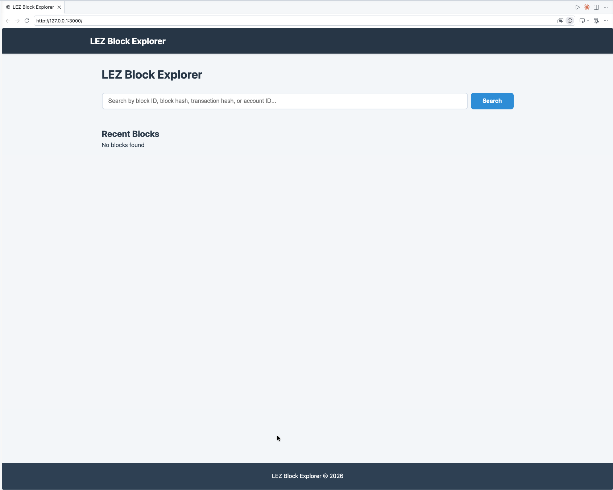
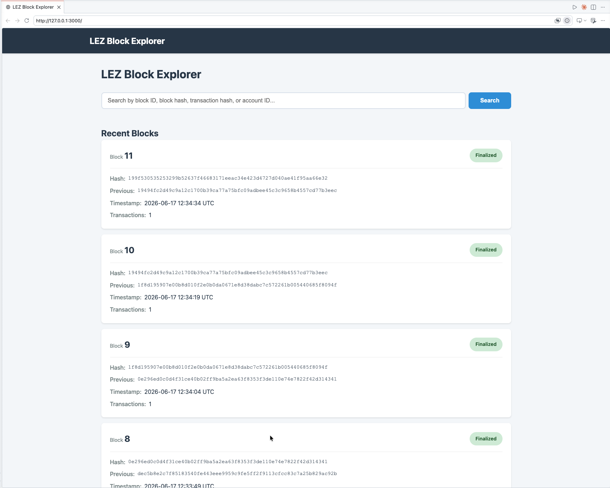
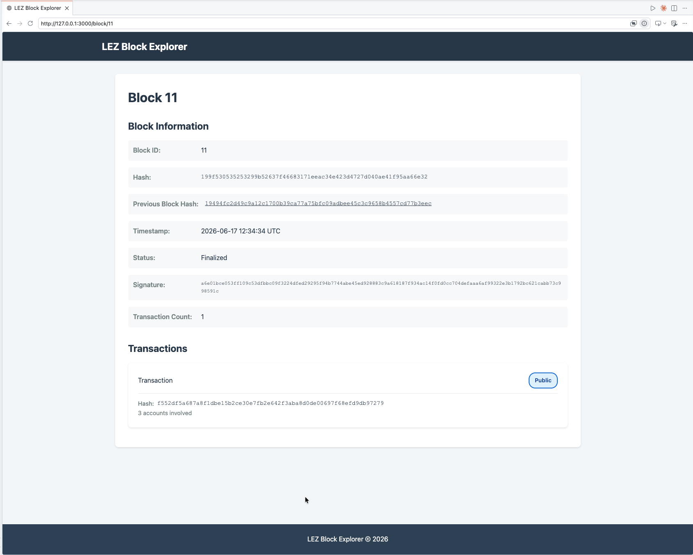
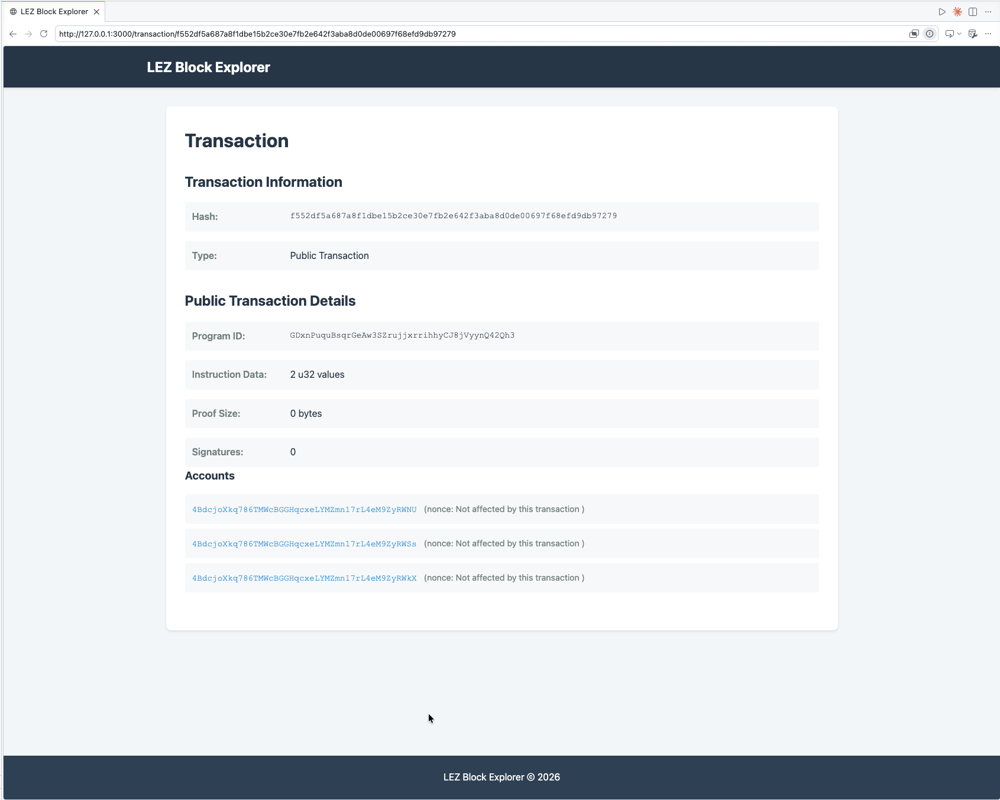
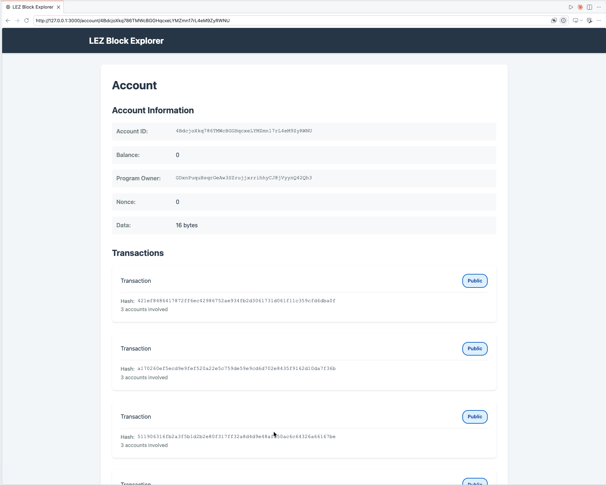

# Start and use an instance of the LEZ Explorer

#### Get a clear view of on-chain activity including blocks, transactions, and accounts.

The LEZ Explorer lets you inspect the state of the Logos Execution Zone in real time. This procedure walks you through starting all required services locally and using the Explorer UI to browse blocks, search transactions, and look up account balances. It is intended for developers working on testnet v0.2 who want to verify on-chain state or test wallet interactions.


If you don't want to run your own LEZ explorer instance, navigate to the [public LEZ explorer](https://explorer.testnet.lez.logos.co/).


Before you start, make sure you have the following:

- Linux or macOS operating system
- [Docker](https://docs.docker.com/get-docker/), [Rust toolchain](https://www.rust-lang.org/tools/install), and `cargo` installed
- [`cargo-leptos`](https://crates.io/crates/cargo-leptos) installed
- [`just`](https://github.com/casey/just) installed
- A local clone of the [LEZ repository](https://github.com/logos-blockchain/logos-execution-zone/)
- A running instance of an [LEZ Indexer](./run-lez-indexer.md)

## What to expect

- You can browse all committed blocks and click through to inspect individual block details.
- You can search for transactions and accounts and view their current state and balances.

## Start the LEZ Explorer

1. Navigate to your local clone of the [LEZ repository](https://github.com/logos-blockchain/logos-execution-zone/).

1. In a new terminal window, start the LEZ Explorer:

   ```bash
   just run-explorer
   ```

   
   By default, the LEZ Explorer connects to the LEZ Indexer at `http://localhost:8779`. Set the `INDEXER_RPC_URL` environment variable or pass `--indexer-rpc-url` to use a different address.
   

1. Open `http://localhost:3000/` in your browser.

   You will see a **No blocks found** message initially:

   

   After approximately one minute, refresh the page. Blocks will appear:

   

## Browse blocks, transactions, and accounts

1. Click any block in the list to view its details.

   

1. Use the search bar to look up a block, transaction, or account by ID.

   

   

## Troubleshooting LEZ Explorer

### Why does the Explorer show "No blocks found" after startup?

Block production takes up to one minute after the stack starts. Refresh the page manually; live updates are not yet implemented.

### Why does LEZ Explorer fail to load block data?

Confirm that the LEZ Indexer is running and reachable. By default, the Explorer connects to `http://localhost:8779`. Check that `just run-indexer` is active in its terminal and that no firewall rule is blocking port `8779`.
