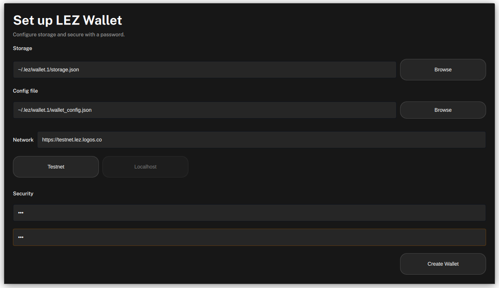
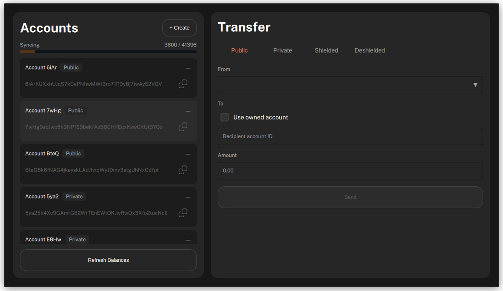
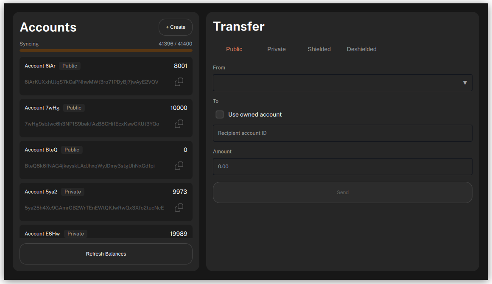
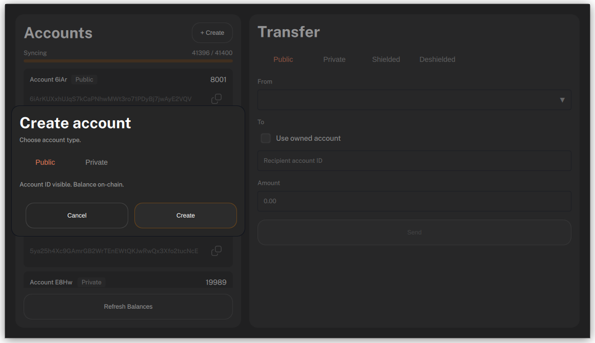
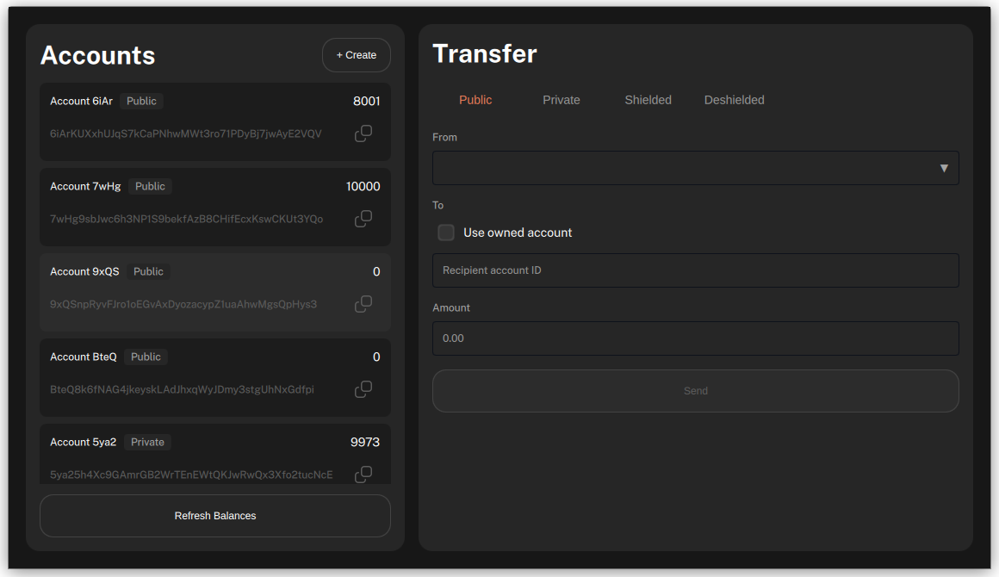
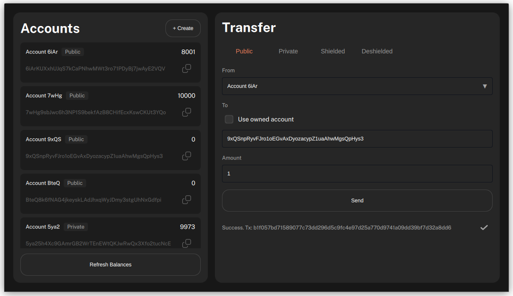
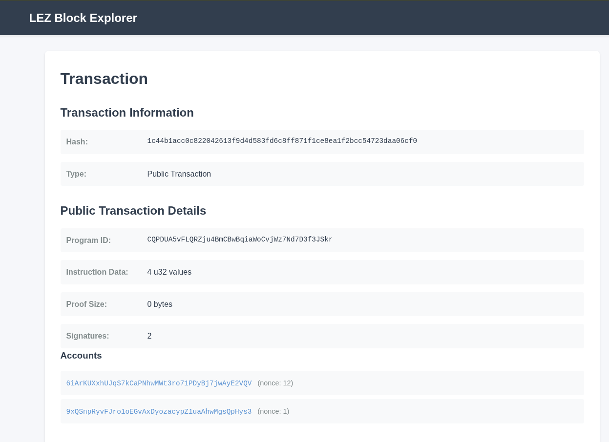

# Initiate native token transfers on the LEZ with the wallet UI

#### Use the wallet UI to set up accounts and try every type of native token transfer on the LEZ testnet.

The wallet UI is a simple entrypoint for getting started on the LEZ. This procedure walks you through running the wallet UI on your machine, syncing it with the public LEZ testnet, creating accounts, and executing all combinations of public, private, shielded, and deshielded native token transfers. The LEZ testnet runs the centralised LEZ sequencer, which processes the transactions the wallet UI submits, while the wallet UI itself manages your accounts locally and can execute transfers with any combination of private and public accounts.


Recovery from mnemonic and withdrawals to the L1 are not yet supported.


Before you begin, ensure you have:

- **Nix** with flakes enabled. Install from [nixos.org](https://nixos.org/download.html), then enable flakes:

  ```bash
  mkdir -p ~/.config/nix
  echo 'experimental-features = nix-command flakes' >> ~/.config/nix/nix.conf
  ```

  Verify: `nix flake --help >/dev/null 2>&1 && echo "Flakes enabled"`

## What to expect

- You can run the wallet UI locally and sync it with the live LEZ testnet.
- You have created and funded accounts that you can use to test transfers.
- You can complete public, private, shielded, and deshielded token transfers and verify finalisation on the L1.

## Set up and sync the wallet UI

This task clones the wallet UI, starts it, and syncs it with the LEZ testnet.

1. Clone the repository and start the wallet UI.

	```bash
	git clone https://github.com/logos-blockchain/logos-execution-zone-wallet-ui.git
	cd logos-execution-zone-wallet-ui
	nix run
	```

	
	On a cold Nix cache, the first run compiles the wallet UI from source (Qt/C++ and Rust dependencies). This can take 20–60 minutes. Subsequent runs are instant from cache.
	

1. In the setup screen, enter paths for the config file and the storage file.

	- The wallet UI creates these files at the paths you enter if they don't already exist.
	- After the first run, the wallet UI remembers these paths and skips the setup screen on subsequent runs.

	

1. Choose a password.
1. Click **Create wallet**.
1. The wallet UI ships with a set of predefined, funded public and private accounts that are shared between all wallet UI users on the testnet and act as a common faucet. Wait for the wallet UI to sync these private account values from the genesis block.

	A progress bar shows the number of blocks processed, and this step can take a few minutes.

	

	The list of accounts and their balances displays once the sync finishes.

	

## Create a new public account

Unlike the predefined accounts on the wallet, accounts you create yourself are controlled only by you and aren't shared.

1. Click **Create account**.
1. Select **Public**.

	

1. Click **Create**.

	The new public account will appear in your account list.

	

## Send a public transfer

This task moves tokens from a funded predefined account to the public account you created.

1. In the **From** field, choose an account with a positive balance.
1. Next to your newly created account, click the copy button to copy its account ID.
1. In the recipient field, paste the account ID.
1. Click **Send**.

	

	A transaction hash displays below the **Send** button. Use its copy button to copy the hash for the next task.

## Verify L1 finalisation

1. In your browser, navigate to `https://explorer.testnet.lez.logos.co/transaction/<TX_HASH>`, replacing `<TX_HASH>` with the transaction hash from the previous task.

	The transaction details display once the transaction is finalised on the L1. Finalisation isn't immediate; it can take around 10 minutes to display.

	

## Try private, shielded, and deshielded transfers

Repeat the create-account and transfer tasks for the other account types and transfer flows.

1. Create one or more private accounts using the same **Create account** flow, selecting **Private** instead of **Public**.
1. Send a private transfer from a private sender to a private recipient.
1. Send a shielded transfer from a public sender to a private recipient.
1. Send a deshielded transfer from a private sender to a public recipient.

## Troubleshooting wallet UI setup

### Why doesn't the setup screen show?

The setup screen is skipped if the config file at `~/.config/Logos/ExecutionZoneWalletUI.conf` already lists paths for the storage and config files, typically from an earlier run of the wallet UI. Remove `~/.config/Logos/ExecutionZoneWalletUI.conf` to see the setup screen again.