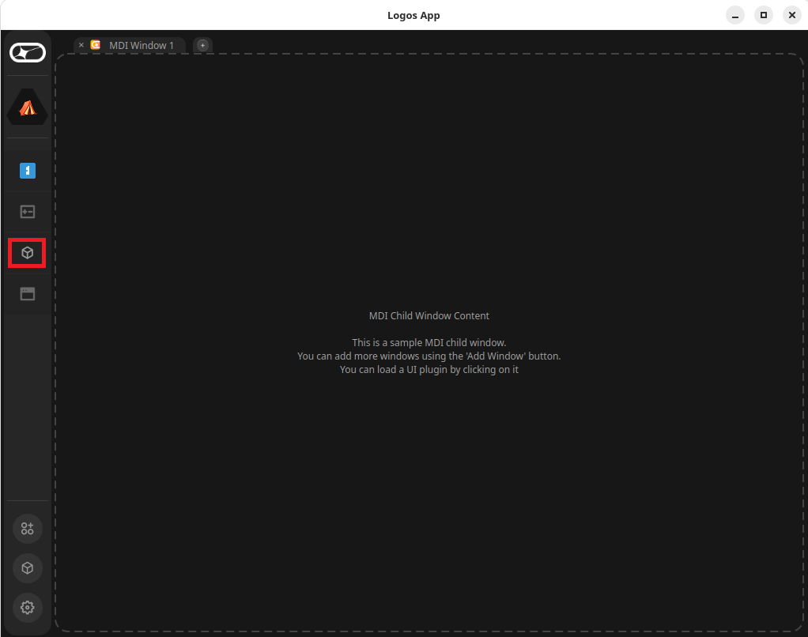
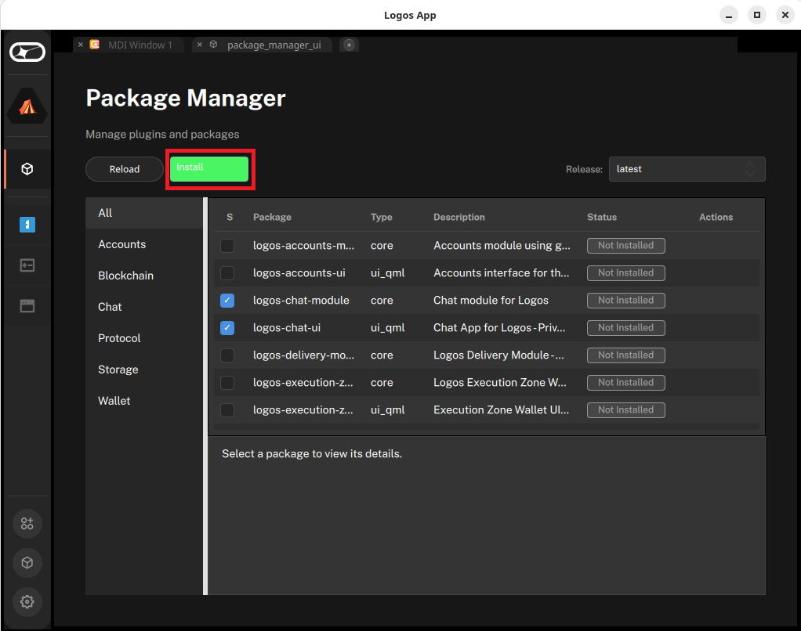

# Send 1:1 messages with the Logos Chat app

#### Try out end-to-end encrypted private messaging over the Logos network.

This procedure shows how to use the Logos Chat app to exchange encrypted 1:1 messages between two running instances. The app is a QML and C++ UI built on top of the [`logos-chat-module`](https://github.com/logos-co/logos-chat-module), which wraps the [Logos Chat SDK](https://github.com/logos-messaging/logos-chat). It demonstrates the basic private-messaging capabilities of the Logos Chat Module: ephemeral identity, intro-bundle handshake, and encrypted messaging with no central server. Use this procedure to verify the setup works or to explore the messaging flow for development purposes.



Identity, conversations, and message history exist only while the app is running. Restarting an instance gives it a new identity and clears all conversations.



You need the following to complete this procedure:

- Linux or macOS
- Network access so both instances can reach each other
- Two running instances of the app — on two separate machines, or in two terminals on the same machine

## What to expect

- You can run the Logos Chat app without building from source by installing it through Logos Basecamp.
- You can exchange encrypted messages between two instances in real time after completing the intro-bundle handshake.
- You can verify delivery by confirming each message appears on the receiving instance within a few seconds.

## Step 1: Run the Logos Chat app

You need two running instances to complete this procedure. Each instance can use either of the options below independently.



When using Nix, all build dependencies — including Qt6, `logos-chat-module`, and `liblogoschat` — are fetched automatically.



### Option A — Run in Logos Basecamp

1. Download and [install](../../basecamp/install-logos-basecamp.md) the latest release of Logos Basecamp from `github.com/logos-co/logos-basecamp/releases`.
1. In the left bar, select **Package Manager**.

   

1. Select `logos-chat-module` and `logos-chat-ui`, then click **Install**.

   

1. Wait until a green **Installed** label appears next to both modules.
1. In the left bar, select **chat** to launch the Logos Chat app.

### Option B — Build and run locally with Nix

1. Clone the repository and check out the target release:

   ```bash
   git clone https://github.com/logos-co/logos-chatsdk-ui
   cd logos-chatsdk-ui
   git checkout v0.1.0
   ```

1. Run the standalone app:

   ```bash
   # Nix fetches all dependencies automatically
   nix run
   ```

## Step 2: Exchange intro bundles

The app auto-initialises on launch and displays your identity ID in the bottom status bar. Perform the steps below on **both** instances — referred to here as **A** and **B**.


**On instance A:**

1. Click **Get Intro Bundle**, then click **Copy to Clipboard**.

   The bundle is a string starting with `logos_chatintro…`.

1. Send the copied bundle to instance B through any out-of-band channel.
1. Close the **My Bundle** popup.

**On instance B:**

1. Click **+ new**.
1. Paste A's intro bundle into the dialogue, then type an intro message (default: `Hello!`).
1. Confirm. A new conversation appears in B's conversation list.

**Back on instance A:**

1. Confirm the new conversation appears automatically in A's conversation list, then select it.
1. Verify that B's intro message is visible in the chat panel.

## Step 3: Send and receive messages

1. Select the shared conversation in either instance.
1. Type a message in the message input field, then press `Enter` or click `>>`.

   Your messages appear right-aligned in the chat panel; the counterparty's messages appear left-aligned, each with a timestamp.

1. From instance A, send a message and observe instance B.

   **Expected result:** the exact message text appears as an incoming (left-aligned) bubble in B's chat panel within a few seconds. A reply from B appears as an incoming bubble in A.

## Troubleshooting Logos Chat

### Messages never arrive and the left panel shows "Waiting for connection…"

Both instances need to reach a shared bootstrap peer to connect to the peer-to-peer network and discover each other. Ensure that both instances have a stable internet connection for peer discovery.

### A previously open conversation has disappeared

Conversations are ephemeral and are not persisted between sessions. Re-exchange intro bundles between the two instances to open a new conversation.
